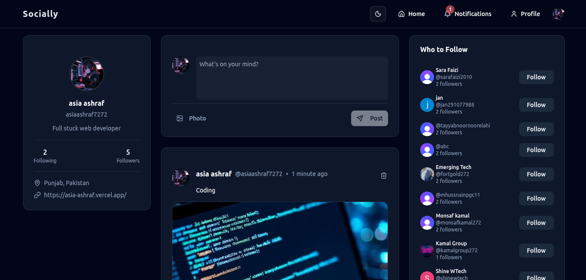

# 🚀 DevConnect

A modern full-stack developer social platform built with Next.js where developers can share posts, showcase projects, connect with others, and communicate through real-time messaging.

## 🌐 Live Demo

https://devconnect-platform-six.vercel.app/

## 📸 Project Preview



## ✨ Features

* 🔐 Authentication with Clerk
* 👤 Developer Profiles
* 📝 Create, Like & Comment on Posts
* 👥 Follow / Unfollow Developers
* 🔔 Real-Time Notifications
* 💬 Real-Time Chat with Stream
* 📩 Direct Messaging & Inbox
* 📊 Unread Message Tracking
* 🖼️ Image Upload Support
* 🧠 Auto Tech Stack Detection
* 🌙 Light / Dark Mode
* 📱 Fully Responsive Design

## 🛠️ Tech Stack

**Frontend**

* Next.js
* React
* Tailwind CSS
* ShadCN UI

**Backend**

* Next.js Server Actions
* Prisma ORM
* PostgreSQL

**Authentication**

* Clerk

**Real-Time Communication**

* Stream Chat
* Stream Webhooks

## 🎯 Vision

DevConnect helps developers share projects, build connections, communicate in real time, and grow within a developer-focused community.


---

## 🔐 Environment Variables

Create a `.env.local` file in the project root and add the following environment variables.

### 🗄️ Database

```env id="5v3qpx"
DATABASE_URL="your_postgresql_database_url"
```

### 🔑 Clerk Authentication

```env id="z8o1nv"
NEXT_PUBLIC_CLERK_PUBLISHABLE_KEY="your_clerk_publishable_key"
CLERK_SECRET_KEY="your_clerk_secret_key"

NEXT_PUBLIC_CLERK_AFTER_SIGN_UP_URL="/"
NEXT_PUBLIC_CLERK_AFTER_SIGN_IN_URL="/"
```

### 📤 UploadThing

```env id="gk6j3s"
UPLOADTHING_TOKEN="your_uploadthing_token"
```

### 🎥 Stream

```env id="j8x2rd"
NEXT_PUBLIC_STREAM_API_KEY="your_stream_api_key"
STREAM_API_SECRET="your_stream_api_secret"
```


---


## 🚀 Future Improvements

* AI-Powered Code Feedback
* Developer Skill Analytics
* Developer Leaderboards
* Global Developer Discovery
* Collaboration Workspaces

---

Built with ❤️ for developers.
